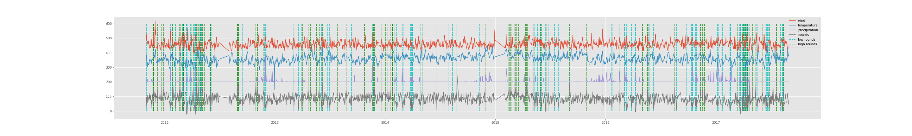

## Golf Staff Predictor
Predicts golf rounds at Diablo Country Club based on weather forecast data to optimize staffing levels.

---

## Data:

### 1. Overview
The data is a combination of course data obtained from Diablo Country Club (DCC) located in Danville, CA and weather data scraped from WeatherUnderground collected by the Livermore Municiple Airport.  The data span nearly 6 years from November 2011 through August 2017.

### 2. Details
#### From Diablo:
  * Rounds (Integer): Target variable - total # of golf rounds played on a given date
  * Tournament rounds (Integer): total # of rounds played by tournament players (tournament players never walk)
  * Walkers (Integer): Total # of rounds played by walking players
  * Day of Week (Integer): Monday : 0 , Sunday : 6
  * Day of Year (Integer)
  * Date (Timestamp): Index

#### From WeatherUnderground (Features):
  * Temerature low, high, average (Fehrenheit) (Integer)
  * Wind speed low, high, average (Mph) (Integer)
  * Humidity low, high, average (%) (Integer)
  * Pressure low, high, average (in) (Float)
  * Dew Point low, high, average (Fehrenheit) (Integer)
  * Precipitation (in) (Float)
  * Visibility (Miles) (Integer)
  * Date (Timestamp): Index

### 3. Engineering
  * Days on which the course was closed were removed.
  * Days which only included tournament rounds were removed because the staffing level of the course follows a different guideline than non-tournament days.
  * Days on which precipitation was recorded as "T" (trace) were converted to 0.001 inches which is 10% of the smallest recorded precipitation.  This value was chosen arbitrarily.
  #### Future Engineering
    * Compute cumulative rainfall in past x # of days to simulate lag or persistence for decision tree models

---

## Exploratory Data Analysis
  * Seasonal decomposition shows a strong seasonal effect on the target variable, rounds.
  * A histogram of the residual rounds shows that it is normally distributed
  * I suggest that the trend in observed rounds could be explained by the amount of rainfall in those years.
  * Plotting the residual of rounds on top of several weather features is an attempt to show motivation that significant changes in rounds can be explained and predicted by weather.  The follow plot shows dashed lines where the # of rounds deviates from the mean by more than 1.5 standard deviations.

  #### Future Exploration
  * plot rounds versus individual weather features to get a sense for their effects on rounds

---

## Modeling:

### 1. Baseline
  * A baseline model the mean of rounds (~85) achieves a rmse of 38.5 rounds.

### 2. Seasonal
  * By predicting the seasonally varying mean of the data we achieve a rmse of 35.2 rounds.

### 3. Decision Tree
  * Iteratively removed low importance features and obtained a final list of important features and their importance ratings:
    - Temperature (high): 0.112
    - Humidity (low): 0.096
    - Day of week: 0.092
    - Pressure: 0.087
    - Dew Point (high): 0.087
    - Temperature (low): 0.083
    - Humidity (high): 0.076
    - Precipitation: 0.076
    - Wind (high): 0.076
    - Pressure (low): 0.073
    - Dew Point (low): 0.072
    - Wind (low): 0.069

  * Grid search was performed for both random forest models and adaptive boosted tree models.

  * Using the features listed above, a non-bootstrapped random forest model with 150 trees and max depth of 6 achieved an rmse of 29.8 rounds.

### 4. ARIMA
  * Fit an ARIMA model with (p,d,q) = (1,1,0) of difference stationarized history from the previous year.

  * Stationarized data was also corrected for seasonal effects by subtracting the rolling average.

  * The model uses the previous year for forecasting, differenced on the data 2 years prior.

  * Using the previous 4 years for validation, the performs with an RMSE of 535 rounds.

  * Forecasting to next year (2017-09 through 2018-08) the model predicts 22,221 rounds will be played.

### Future Models
  * ARIMAX

---

## Web Application:

### 1. UI/UX
  * I plan to make a stylish and well-tested web application with a plethora of interactive and informative tools
  * Staff members will sign-in to obtain a prediction of rounds played based on recent weather and the weather forecast for a specified # of days.
  * Club members will sign-in to obtain a prediction of the "playability" of the course based on recent weather and the weather forecast.

### 2. Database
  * Staff members will interact with database on S3 that can be updated and modified via the web application.  The database will be used to improve on the model over time.
  * Weather forecast data with be requested in real time using the `pywapi` package and combined with a model that is updated on a semi-frequent schedule.

A test version of the application currently exists at http://test-eb-dev.us-east-2.elasticbeanstalk.com/