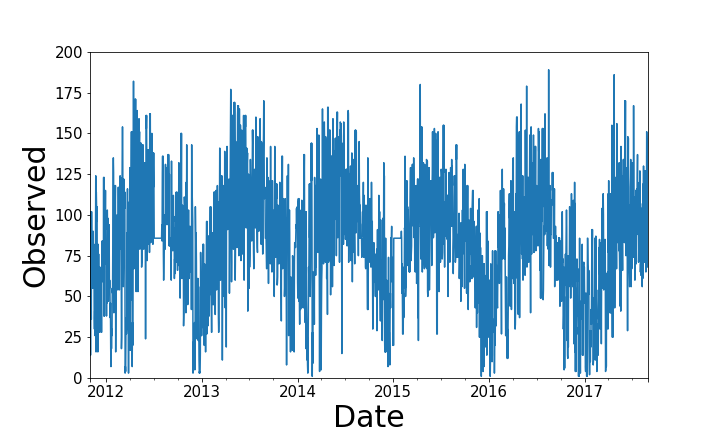
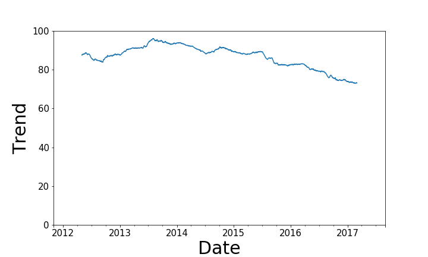

# Diablo Country Club Golfability Predictor
Predicts golf rounds at Diablo Country Club based on weather forecast data and measures golfability.

Web Application URL: http://diabloCC-golfability.us-east-2.elasticbeanstalk.com/

## Introduction:
I aimed to answer the question "Will the golf course be crowded tomorrow?".  I partnered with Diablo Country Club and was given 6 years of daily course data to work with.  I used the number of rounds played on a given day as an indicator for crowds.  I combined the data with historical weather data that I scraped from WeatherUnderground to improve the predictive power of my model.  The motivation was that I could build a web application to fetch the 10-day weather forecast and use that to predict crowds in the future.  The application is deployed on AWS and used by members to plan their golfing schedule for maximum enjoyment.  The application is also used by the course director to target to crowd days and for promotional offerings.

Observed crowds for the 6 year data set.

 

Trend component of the seasonally decomposed rounds.

 

## Data:

### 1. Overview
The data is a combination of course data obtained from Diablo Country Club located in Danville, CA and weather data scraped from WeatherUnderground collected by the Livermore Municiple Airport.  The data span nearly 6 years from November 2011 through August 2017.

### 2. Details
#### From Diablo (Target):
  * Rounds (Integer): Target variable - total # of golf rounds played on a given date
  * Tournament rounds (Integer): total # of rounds played by tournament players (tournament players never walk)
  * Walkers (Integer): Total # of rounds played by walking players
  * Day of Week (Integer): Monday : 0 , Sunday : 6
  * Day of Year (Integer)
  * Date (Timestamp): Index
  * Notes (Text): Comments on weather and other aspects about the course that day

#### From WeatherUnderground (Feature matrix):
  * Temerature low, high, average (Fehrenheit) (Integer)
  * Wind speed low, high, average (Mph) (Integer)
  * Humidity low, high, average (%) (Integer)
  * Pressure low, high, average (in) (Float)
  * Dew Point low, high, average (Fehrenheit) (Integer)
  * Precipitation (in) (Float)
  * Visibility (Miles) (Integer)
  * Date (Timestamp): Index

### 3. Engineering
  * Days on which the course was closed were removed.
  * Days which only included tournament rounds were removed because the staffing level of the course follows a different guideline than non-tournament days.
  * Days on which precipitation was recorded as "T" (trace) were converted to 0.001 inches which is 10% of the smallest recorded precipitation.  This value was chosen arbitrarily.
  * Computed cumulative rainfall from the day before to simulate lag or persistence for decision tree models

## Exploratory Data Analysis
  * Seasonal decomposition shows a strong seasonal effect on the target variable, rounds.
  * The course director suggested that the trend in observed rounds could be explained by the amount of rainfall in recent years.
  * plotted scatter of weather features and target to get a sense of interactions and weather effects of rounds.

## Modeling:

### 1. Baseline
  * A baseline model the mean of rounds (~85) achieves a rmse of 38.5 rounds.

### 2. Seasonal
  * By predicting the seasonally varying mean of the data we achieve a rmse of 35.2 rounds.  This suggests a moving standard deviation of 35 rounds on any given day.

### 3. Decision Trees
  * Iteratively removed low importance features and obtained a final list of important features and their importance ratings:
    - DOW: 0.279
    - \sqrt{Temperature High}: 0.184
    - Temperature High: 0.17
    - Day of Year: 0.087
    - Precipitation: 0.058
    - \sqrt{Precipitation}: 0.048
    - Month: 0.040
    - Year: 0.025
    - \sqrt{Average Humidity}: 0.017
    - Average Humidity: 0.015
    - Sea Level Pressure High: 0.015
    - Cummulative Precipitation: 0.014
    - Temperature Low: 0.013
    - Wind Speed High: 0.012
    - Average Dewpoint: 0.01
    - Visibility Low: 0.007
    - Rain Boolean: 0.003

  * Grid search was performed for both random forest models and adaptive boosted tree models.

  * Using the features listed above, a bootstrapped random forest model with 50 trees and max depth of 8 achieved a 10-fold cross-validated train rmse of 22.1 rounds.

  * The same model achieved a test RMSE of  25.1 rounds on unseen test data.

## Web Application:

### 1. UI/UX
  * Anyone can visit the webpage at http://diabloCC-golfability.us-east-2.elasticbeanstalk.com/
  * Users click the "Get Prediction" button to obtain a prediction of the crowd level for next 10 days.
  * The applications applies a custom "golfability" formula with variables crowd level and weather conditions.

